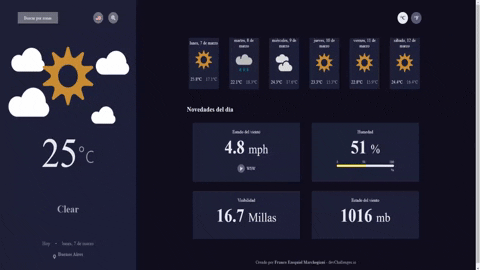

<!-- Please update value in the {}  -->

<h1 align="center">Weather App Challenge</h1>

<div align="center">
   Solución a desafío de la mano de:  <a href="http://devchallenges.io" target="_blank">Devchallenges.io</a>.
</div>

<div align="center">
  <h3>
    <a target="_blank" href="https://franco-ezequiel-marchegiani.github.io/challenge-weatherReport/">
      Solution
    </a>
    <span> | </span>
    <a target="_blank" href="https://devchallenges.io/challenges/mM1UIenRhK808W8qmLWv">
      Challenge
    </a>
  </h3>
</div>

<!-- TABLE OF CONTENTS -->

## Table of Contents

- [Vista Previa](#Vista_previa)
- [Construido Utilizando](#Construido_utilizando)
- [Características](#caracteristicas)
- [Cómo Utilizar la página](#como_usar_pagina)
- [Contacto](#contacto)

<!-- OVERVIEW -->
## Vista_previa 





- Dónde puedo ver la página funcionando?
La misma la encontrarás accediendo al <a href="https://franco-ezequiel-marchegiani.github.io/challenge-weatherReport/">siguiente link</a> 
- Mi experiencia realizando el proyecto:
Disfruté mucho el proceso de realización de la app, fue un desafío en muchos momentos, y sobre todo al final, pero fue bastante agradable el realizar una página desde 0, con un buen diseño y reforzando los conocimientos que poseo (y también aprendiendo nuevas cosas)
- Qué aprendiste y/o mejoré al hacer el desafío:
Algo que considero importante que pude aprender, es el pasar información de un componente hijo, a otro componente hijo (pasandolo por el padre) utilizando React.Js, es algo de lo que no tenía ni idea que se podía hacer. También mejoré mis conocimientos y experiencias en la librería React en sí, haciendo llamados a una API, añadiendo estados y condicionales a la hora de mostrar la vista al usuario :)
- Mi moraleja:
Aprendí la importancia de estar siempre metido en el código, y de practicar en todo momento lo que uno sabe, ya que algunas cosas pueden olvidarse, y al final del día lo que queda es una sensación gratificante de no solo poner en práctica lo que uno sabe, sino de poder ver el fruto del esfuerzo y hacer una página la cual antes no había hecho, realmente es algo que le recomiendo a cualquier programador que esté iniciando.

### Construido_utilizando

<!-- This section should list any major frameworks that you built your project using. Here are a few examples.-->

- [React](https://reactjs.org/)
- [Bootstrap (React)](https://react-bootstrap.github.io/components/alerts/)
- [Meta Weather API](https://www.metaweather.com/api/)
- [Fontawesome](https://fontawesome.com/)

## caracteristicas

<!-- List the features of your application or follow the template. Don't share the figma file here :) -->
### Las características o detalles a destacar de esta página son los siguientes

#### Características del usuario

- El usuario puede acceder a la información del clima de una ciudad por default, sin tener que hacer nada más que abrir la página
- Se pueden realizar búsquedas por ciudades, y la información se actualiza a corde la ciudad seleccionada
- Se puede obtener la información del día de la fecha, y de los próximos 5 días
- Se puede ver la fecha y ubicación del clima
- Se visualizan los distintos tipos de climas acorde a íconos
- Se puede ver la temperatura mínima y máxima del día y de los próximos 5 días
- Se puede ver la dirección y el estado del viento
- Se puede ver el porcentaje de humedad, y cuenta con una barra que indica el porcentaje del mismo
- Se puede ver el número de la presión del aire
- Posee un indicador de visibilidad
- Cuenta con un botón para cambiar el lenguaje Español / Inglés

#### Características técnicas

- Se utilizó el llamado a una API de terceros
- Contiene componentes re-utilizable, los cuales son el recuadro de los próximos 5 días, y los 4 recuadros con la información del día de hoy (los cuales muestran información sobre el estado del viento, humedad, visibilidad & presión de aire)
- Contiene una barra de búsqueda la cual responde en tiempo real (es decir, ni bien el usuario presione las teclas), lo cual también posee un llamado a una API
- El proyecto es 100% responsive y adaptable a cualquier dispositivo
## como_usar_pagina

<!-- Example: -->

Para clonar y correr la aplicación, necesitarás [Git](https://git-scm.com) & [Node.js](https://nodejs.org/en/download/) (El cual viene en [npm](http://npmjs.com)) e instalarlo en tu computadora. Y luego colocar las siguientes líneas de comando:

```bash
# Clone this repository
$ git clone https://github.com/Franco-Ezequiel-Marchegiani/challenge-weatherReport

# Install dependencies
$ npm install

# Run the app
$ npm start

## contacto

- Portfolio [franco-ezequiel-marchegiani](https://franco-ezequiel-marchegiani.github.io/portfolio/})
- GitHub [@Franco-Ezequiel-Marchegiani](https://github.com/Franco-Ezequiel-Marchegiani)
